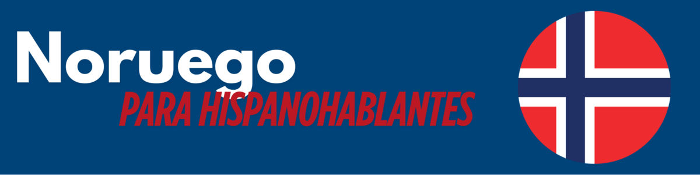

---

# ¡Bienvenido!

## Introducción

**Noruego para hispanohablantes** es un curso online para principiantes, orientado a hispanohablantes sin conocimientos previos.

El objetivo es alcanzar el nivel **A1** del **Marco Común Europeo de Referencia para las Lenguas (MCER)**, con un enfoque práctico, cultural y accesible.

---

## ¿Qué aprenderás?

- Comprender y utilizar expresiones cotidianas básicas.
- Presentarte, saludar y mantener conversaciones simples.
- Hablar sobre el clima y expresar preferencias.
- Conocer aspectos culturales clave para desenvolverte en Noruega.

---

# Estructura del curso

## Duración y organización

- Duración estimada: **180 minutos**.
- 3 lecciones principales con contenidos teóricos y ejercicios prácticos.
- Recursos adicionales para reforzar el aprendizaje.
- Navegación web fluida desde cualquier dispositivo.

---

## Lección 1: Saludos y presentaciones

- Vocabulario esencial para iniciar una conversación.
- Estructura básica de las frases y formación de preguntas.
- Contexto cultural noruego en los saludos.

---

## Lección 2: El clima y conversaciones cotidianas

- Vocabulario sobre el tiempo y las estaciones.
- Cómo iniciar conversaciones informales.
- Gramática básica con estructuras del tipo “Det er...”.

---

## Lección 3: Gustos y preferencias

- Verbos y expresiones para hablar sobre aficiones.
- Preguntas útiles para socializar.
- Apreciación del estilo de vida y actividades típicas noruegas.

---

# Recursos complementarios

## Glosario noruego-español

- Organizado por categorías temáticas.
- Disponible en formato EPUB.
- Referencia rápida de vocabulario útil.

---

## Introducción a la cultura noruega

- Lecturas breves sobre costumbres y sociedad.
- Expresiones comunes y ejercicios de comprensión lectora.
- Recurso descargable e integrado en el aprendizaje lingüístico.

---

## Narrativa interactiva

- Historia en Twine donde serás un estudiante Erasmus en Noruega.
- Aplica el vocabulario aprendido en contextos reales.
- Aprendizaje lúdico e inmersivo.

---

# Acceso al curso

## ¿Cómo navegar?

- Curso publicado en **GitHub Pages**.
- Estructura continua, sin recarga entre lecciones.
- Accesible desde navegador, sin instalaciones.

---

## ¿Qué necesitas?

- Un navegador web y conexión a internet.
- Ganas de aprender.
- Puedes seguir el ritmo que prefieras y descargar los materiales.
  
---

# ¡Comienza tu viaje lingüístico!

## Lykke til! (¡Buena suerte!)

Explora las lecciones, sumérgete en la cultura y empieza a comunicarte en noruego.  
Haz clic en la primera lección para comenzar.
